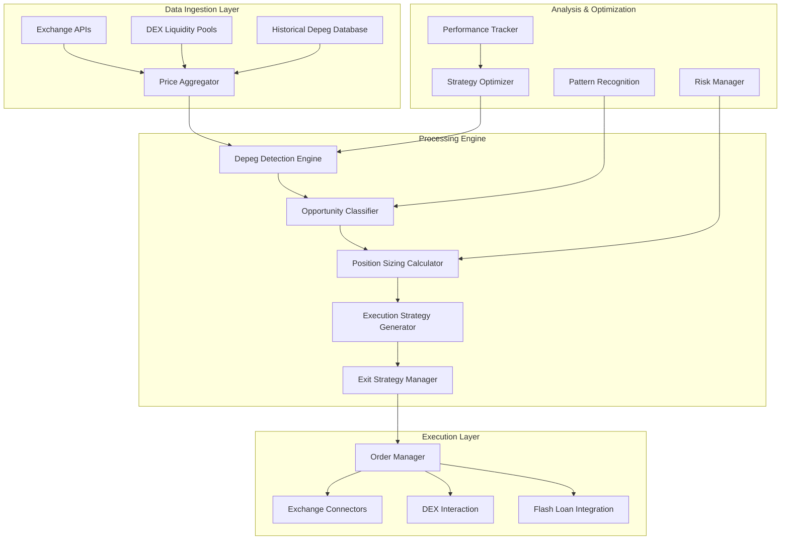

# Stablecoin Depeg Exploitation System Design

## Overview

The Stablecoin Depeg Exploitation System is designed to capitalize on temporary deviations of stablecoins from their pegged value. This system leverages the mathematical certainty that stablecoins will eventually return to their peg, creating high-probability, low-risk trading opportunities. The system monitors stablecoin prices across multiple exchanges, detects depegging events, calculates optimal position sizes, executes trades with appropriate timing and leverage, and automatically exits positions when the stablecoin returns to peg.

## Architecture

### High-Level Architecture



### Core Components Architecture

The system follows a microservices architecture with the following key principles:

- **Real-time monitoring**: Sub-second price updates across multiple exchanges
- **High availability**: 99.9% uptime with automatic failover
- **Scalability**: Horizontal scaling for monitoring more stablecoins and exchanges
- **Risk management**: Comprehensive risk controls to prevent excessive exposure

## Components and Interfaces

### 1. Data Ingestion Layer

#### Price Aggregator

```typescript
interface PriceAggregator {
  subscribeToStablecoinPrices(stablecoins: string[]): Observable<StablecoinPrice>;
  getHistoricalPrices(stablecoin: string, timeframe: TimeFrame): Promise<StablecoinPriceHistory>;
  getExchangeLiquidity(stablecoin: string, exchange: string): Promise<LiquidityData>;
  calculatePegDeviation(price: number, pegValue: number): number;
  getAveragePriceAcrossExchanges(stablecoin: string): Promise<AveragePrice>;
}
```

#### Historical Depeg Database

```typescript
interface DepegHistoryDatabase {
  recordDepegEvent(event: DepegEvent): Promise<void>;
  getHistoricalDepegEvents(stablecoin: string, timeframe: TimeFrame): Promise<DepegEvent[]>;
  calculateAverageReversionTime(magnitude: number, stablecoin: string): Promise<number>;
  findSimilarHistoricalEvents(currentEvent: DepegEvent): Promise<DepegEvent[]>;
  getSuccessRate(stablecoin: string, magnitude: Range): Promise<number>;
}
```

### 2. Processing Engine

#### Depeg Detection Engine

```typescript
interface DepegDetectionEngine {
  startMonitoring(stablecoins: string[], threshold: number): void;
  stopMonitoring(): void;
  getActiveDepegEvents(): DepegEvent[];
  subscribeToDepegAlerts(): Observable<DepegAlert>;
  calculateDepegMagnitude(currentPrice: number, pegPrice: number): number;
  classifyDepegSeverity(magnitude: number): DepegSeverity;
}
```

#### Opportunity Classifier

```typescript
interface OpportunityClassifier {
  classifyOpportunity(depegEvent: DepegEvent): DepegOpportunity;
  rankOpportunities(opportunities: DepegOpportunity[]): RankedOpportunity[];
  calculateExpectedProfit(opportunity: DepegOpportunity): number;
  estimateReversionTime(opportunity: DepegOpportunity): number;
  calculateSuccessProbability(opportunity: DepegOpportunity): number;
}
```

#### Position Sizing Calculator

```typescript
interface PositionSizingCalculator {
  calculateOptimalPositionSize(opportunity: DepegOpportunity, accountBalance: number): number;
  determineLeverageMultiple(opportunity: DepegOpportunity): number;
  calculateRiskExposure(positionSize: number, opportunity: DepegOpportunity): RiskMetrics;
  allocateCapitalAcrossOpportunities(opportunities: RankedOpportunity[], availableCapital: number): AllocationPlan;
  calculateStopLossLevel(opportunity: DepegOpportunity, positionSize: number): number;
}
```

#### Execution Strategy Generator

```typescript
interface ExecutionStrategyGenerator {
  generateExecutionPlan(opportunity: DepegOpportunity, positionSize: number): ExecutionPlan;
  splitOrdersAcrossExchanges(positionSize: number, exchanges: ExchangeLiquidity[]): SplitOrders;
  determineOrderTypes(opportunity: DepegOpportunity): OrderTypeStrategy;
  calculateEntryPriceTargets(opportunity: DepegOpportunity): PriceTargets;
  evaluateFlashLoanPotential(opportunity: DepegOpportunity, positionSize: number): FlashLoanEvaluation;
}
```

#### Exit Strategy Manager

```typescript
interface ExitStrategyManager {
  generateExitPlan(position: DepegPosition): ExitPlan;
  monitorReversionProgress(position: DepegPosition): Observable<ReversionUpdate>;
  calculateOptimalExitTiming(position: DepegPosition, currentPrice: number): ExitTiming;
  implementPartialExitStrategy(position: DepegPosition, marketConditions: MarketConditions): PartialExitPlan;
  determineExitOrderTypes(position: DepegPosition): OrderTypeStrategy;
}
```

### 3. Execution Layer

#### Order Manager

```typescript
interface OrderManager {
  executeEntryOrders(executionPlan: ExecutionPlan): Promise<ExecutionResult>;
  executeExitOrders(exitPlan: ExitPlan): Promise<ExecutionResult>;
  monitorOrderStatus(orderId: string): Observable<OrderStatus>;
  cancelAndReplaceOrders(oldOrders: Order[], newOrders: Order[]): Promise<OrderUpdateResult>;
  executeFlashLoanTrade(flashLoanPlan: FlashLoanPlan): Promise<FlashLoanResult>;
}
```

#### Exchange Connectors

```typescript
interface ExchangeConnector {
  placeOrder(order: Order): Promise<OrderResult>;
  getOrderStatus(orderId: string, exchange: string): Promise<OrderStatus>;
  cancelOrder(orderId: string, exchange: string): Promise<CancelResult>;
  getAccountBalance(exchange: string): Promise<Balance>;
  getWithdrawalFees(asset: string, exchange: string): Promise<Fee>;
}
```

#### DEX Interaction

```typescript
interface DexInteraction {
  getPoolLiquidity(dex: string, pair: string): Promise<PoolLiquidity>;
  calculatePriceImpact(dex: string, pair: string, amount: number): Promise<PriceImpact>;
  executeDexTrade(trade: DexTrade): Promise<DexTradeResult>;
  estimateGasCosts(trade: DexTrade): Promise<GasCost>;
  monitorPendingTransaction(txHash: string): Observable<TransactionStatus>;
}
```

#### Flash Loan Integration

```typescript
interface FlashLoanIntegration {
  getAvailableProtocols(): Promise<FlashLoanProtocol[]>;
  calculateLoanFees(protocol: string, asset: string, amount: number): Promise<Fee>;
  executeFlashLoanArbitrage(plan: FlashLoanArbitragePlan): Promise<FlashLoanResult>;
  validateArbitrageProfitability(plan: FlashLoanArbitragePlan): Promise<ProfitabilityAnalysis>;
  monitorProtocolChanges(): Observable<ProtocolUpdate>;
}
```

## Data Models

### Core Data Models

```typescript
interface StablecoinPrice {
  stablecoin: string;
  exchange: string;
  price: number;
  timestamp: Date;
  volume24h: number;
  bid: number;
  ask: number;
  spreadPercentage: number;
}

interface DepegEvent {
  id: string;
  stablecoin: string;
  exchanges: ExchangePrice[];
  startTime: Date;
  magnitude: number;
  direction: 'premium' | 'discount';
  severity: DepegSeverity;
  averagePrice: number;
  pegValue: number;
  liquidityScore: number;
  estimatedReversionTime: number;
  status: 'active' | 'resolved' | 'worsening';
}

interface DepegOpportunity {
  event: DepegEvent;
  expectedProfit: number;
  successProbability: number;
  estimatedReversionTime: number;
  optimalPositionSize: number;
  recommendedLeverage: number;
  riskScore: number;
  exchangeAllocation: ExchangeAllocation[];
  flashLoanViable: boolean;
}

interface DepegPosition {
  id: string;
  opportunity: DepegOpportunity;
  entryOrders: OrderResult[];
  entryPrice: number;
  positionSize: number;
  leverage: number;
  entryTime: Date;
  currentPrice: number;
  currentPnL: number;
  pnlPercentage: number;
  stopLossPrice: number;
  targetPrice: number;
  status: 'opening' | 'open' | 'closing' | 'closed';
}

interface ExecutionPlan {
  opportunity: DepegOpportunity;
  orders: PlannedOrder[];
  totalPositionSize: number;
  estimatedFees: number;
  estimatedSlippage: number;
  flashLoanPlan?: FlashLoanPlan;
  stopLossOrders: PlannedOrder[];
  executionStrategy: 'immediate' | 'staged' | 'flash_loan';
}

interface ExitPlan {
  position: DepegPosition;
  exitOrders: PlannedOrder[];
  targetExitPrice: number;
  exitTriggers: ExitTrigger[];
  partialExitThresholds: PartialExitThreshold[];
  estimatedFees: number;
  estimatedProfit: number;
  profitPercentage: number;
}
```

### Supporting Data Models

```typescript
enum DepegSeverity {
  MINOR = 'minor',     // 0.05-0.2%
  MODERATE = 'moderate', // 0.2-1%
  SEVERE = 'severe',    // >1%
  EXTREME = 'extreme'   // >5%
}

interface ExchangePrice {
  exchange: string;
  price: number;
  volume24h: number;
  liquidity: number;
}

interface ExchangeAllocation {
  exchange: string;
  percentage: number;
  amount: number;
  estimatedSlippage: number;
}

interface PlannedOrder {
  exchange: string;
  side: 'buy' | 'sell';
  type: 'market' | 'limit';
  amount: number;
  price?: number;
  timeInForce: 'GTC' | 'IOC' | 'FOK';
  estimatedFee: number;
  estimatedSlippage: number;
}

interface FlashLoanPlan {
  protocol: string;
  asset: string;
  amount: number;
  fee: number;
  steps: FlashLoanStep[];
  estimatedProfit: number;
  estimatedGasCost: number;
  netProfit: number;
}

interface ExitTrigger {
  type: 'price' | 'time' | 'reversion_percentage' | 'manual';
  value: number;
  action: 'full_exit' | 'partial_exit';
}

interface PartialExitThreshold {
  reversionPercentage: number;
  exitPercentage: number;
}
```

## Error Handling

### Error Categories and Responses

1. **Price Feed Errors**
   - Automatic fallback to alternative price sources
   - Data validation to detect anomalies
   - Circuit breaker for extreme price movements

2. **Exchange API Errors**
   - Retry with exponential backoff
   - Failover to alternative exchanges
   - Order status reconciliation

3. **Execution Errors**
   - Partial fill handling
   - Order adjustment based on market conditions
   - Position reconciliation

4. **Flash Loan Errors**
   - Transaction simulation before execution
   - Gas price optimization
   - Fallback to traditional execution

### Emergency Protocols

```typescript
interface EmergencyProtocol {
  handlePriceFeedFailure(stablecoin: string): Promise<void>;
  handleExchangeOutage(exchange: string): Promise<void>;
  handleLiquidityCrisis(stablecoin: string): Promise<void>;
  implementCircuitBreaker(condition: CircuitBreakerCondition): Promise<void>;
  notifyAdministrators(severity: AlertSeverity, message: string): Promise<void>;
}
```

## Performance Optimization

### Latency Optimization

- Use WebSocket connections for real-time price updates
- Implement local caching for frequently accessed data
- Prioritize critical path operations

### Throughput Optimization

- Batch non-time-critical operations
- Implement parallel processing for independent operations
- Use connection pooling for database and API interactions

### Resource Optimization

- Implement adaptive monitoring frequency based on market volatility
- Use tiered storage for historical data
- Implement efficient data structures for real-time processing

## Integration Points

### Internal System Integration

- **Flash Loan Engine**: For amplifying returns on high-confidence opportunities
- **Cross-Exchange Arbitrage Engine**: For exploiting price differences across exchanges
- **Risk Management System**: For position sizing and exposure control
- **Performance Monitoring System**: For tracking and optimizing strategy performance

### External System Integration

- **Exchange APIs**: For price data and trade execution
- **DEX Protocols**: For on-chain liquidity and trading
- **Flash Loan Protocols**: For zero-capital arbitrage
- **Market Data Providers**: For additional price and liquidity data

## Testing Strategy

### Unit Testing

- Test each component in isolation with mock dependencies
- Validate calculation accuracy for position sizing and profit estimation
- Ensure proper error handling and recovery

### Integration Testing

- Test interaction between components
- Validate end-to-end workflow from detection to execution
- Test failover and recovery mechanisms

### Simulation Testing

- Replay historical depeg events to validate strategy
- Simulate various market conditions to test robustness
- Measure performance metrics under different scenarios

### Production Validation

- Start with small position sizes in production
- Gradually increase exposure as confidence builds
- Continuously monitor and optimize performance

## Deployment Strategy

### Initial Deployment

- Deploy monitoring system first
- Add execution capabilities incrementally
- Start with major stablecoins (USDT, USDC, DAI)

### Scaling Strategy

- Add more stablecoins over time
- Increase exchange coverage
- Enhance prediction models with more historical data

### Monitoring and Maintenance

- Implement comprehensive logging
- Set up alerting for critical events
- Regularly review and optimize strategy parameters

## Future Enhancements

1. **Machine Learning Integration**: Enhance prediction models with machine learning
2. **Cross-Asset Correlation**: Identify correlations between depeg events and other market factors
3. **Multi-Stablecoin Strategies**: Develop strategies that exploit relationships between different stablecoins
4. **Regulatory Monitoring**: Integrate with regulatory monitoring to anticipate depeg events
5. **Liquidity Provision**: Explore opportunities to provide liquidity during depeg events